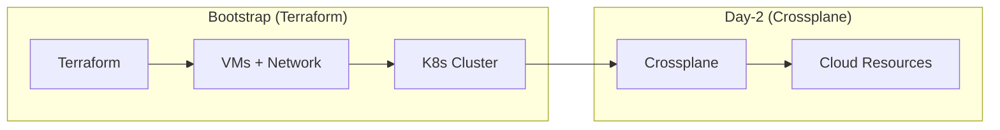
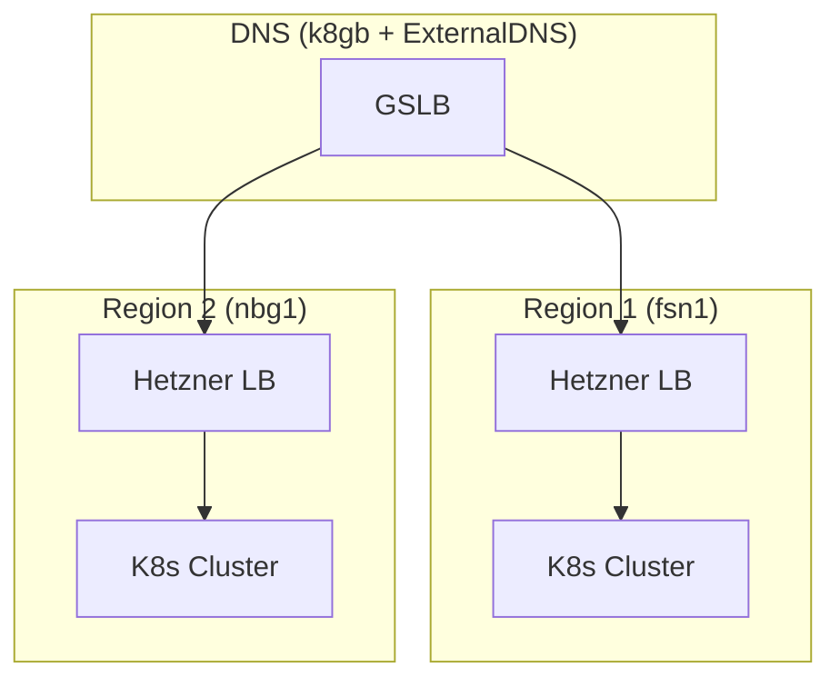

# Terraform

Infrastructure as Code for OpenOva Kubernetes platform (bootstrap only).

**Status:** Accepted | **Updated:** 2026-02-07

---

## Overview

Terraform provisions the initial infrastructure for Kubernetes clusters. After bootstrap, **Crossplane** handles all day-2 cloud resource provisioning.



---

## Infrastructure Providers

### Provider Status

| Provider | Status | Crossplane | Notes |
|----------|--------|------------|-------|
| **Hetzner Cloud** | **Primary** | provider-hcloud | Best value, API quality |
| Huawei Cloud | Coming | provider-huaweicloud | China/APAC focus |
| Oracle Cloud (OCI) | Coming | provider-oci | Always Free tier |
| AWS | Coming | provider-aws | Full featured |
| GCP | Coming | provider-gcp | Full featured |
| Azure | Coming | provider-azure | Full featured |
| ~~Contabo~~ | **Dropped** | None | No Crossplane support |

### Why Hetzner Cloud?

| Factor | Hetzner | AWS/GCP/Azure | Contabo |
|--------|---------|---------------|---------|
| Cost | Low | High | Low |
| Crossplane | provider-hcloud | Full support | **None** |
| API Quality | Good | Excellent | Basic |
| Regions | EU, US | Global | EU, US, Asia |
| LoadBalancer | Native | Native | None |

**Key Decision:** Contabo dropped due to lack of Crossplane provider support.

---

## Cost Comparison

### Budget Providers (Under $25/month for 24GB RAM)

| Provider | Cost/24GB | Terraform Support | Notes |
|----------|-----------|-------------------|-------|
| **Hetzner** | ~€21 | Official | **Selected** - Best API, Crossplane support |
| Netcup | ~€20 | None | No automation |
| Hostinger | ~€24 | Official | Less mature |

### Mid-Range Providers ($50-150/month)

| Provider | Cost/24GB | Notes |
|----------|-----------|-------|
| Vultr | ~$105 | Best global coverage |
| DigitalOcean | ~$95 | Excellent docs |
| Linode/Akamai | ~$179 | Akamai backing |

### Hyperscalers

| Provider | Cost/24GB | Notes |
|----------|-----------|-------|
| Oracle | ~$96/$0 | Free tier but capacity issues |
| AWS | ~$263 | Full featured |
| GCP | ~$284 | Full featured |
| Azure | ~$282 | Full featured |

---

## Hetzner Configuration

### Available Regions

| Region | Location | Use Case |
|--------|----------|----------|
| `fsn1` | Falkenstein, DE | Primary EU |
| `nbg1` | Nuremberg, DE | DR EU |
| `hel1` | Helsinki, FI | EU alternative |
| `ash` | Ashburn, US | Primary US |
| `hil` | Hillsboro, US | DR US |

### Instance Types

| Type | vCPU | RAM | SSD | Monthly |
|------|------|-----|-----|---------|
| CX22 | 2 | 4GB | 40GB | €4.59 |
| CX32 | 4 | 8GB | 80GB | €9.18 |
| CX42 | 8 | 16GB | 160GB | €18.35 |
| CX52 | 16 | 32GB | 320GB | €36.70 |

**Recommended:** CX32 (3 nodes) for minimum production cluster

---

## Directory Structure

```
terraform/
├── modules/
│   ├── hetzner-vm/        # Hetzner VPS provisioning
│   ├── k3s-cluster/       # K3s installation
│   └── dns-failover/      # CoreDNS + k8gb
├── environments/
│   ├── hetzner-eu/        # Primary (Falkenstein)
│   └── hetzner-us/        # US region
└── README.md
```

---

## Quick Start

```bash
cd environments/hetzner-eu

# Bootstrap wizard handles credentials interactively
# Creates terraform.tfvars (not committed to Git)

# Initialize and apply
terraform init
terraform plan -var-file=terraform.tfvars
terraform apply -var-file=terraform.tfvars
```

---

## Terraform Configuration

### Hetzner Provider

```hcl
terraform {
  required_providers {
    hcloud = {
      source  = "hetznercloud/hcloud"
      version = "~> 1.45"
    }
  }
}

provider "hcloud" {
  token = var.hcloud_token
}

resource "hcloud_server" "k8s_node" {
  count       = 3
  name        = "<tenant>-k8s-${count.index + 1}"
  server_type = "cx32"
  image       = "ubuntu-22.04"
  location    = "fsn1"

  ssh_keys = [hcloud_ssh_key.default.id]

  labels = {
    tenant = "<tenant>"
    role   = "k8s-node"
  }
}

resource "hcloud_network" "k8s_network" {
  name     = "<tenant>-network"
  ip_range = "10.0.0.0/16"
}

resource "hcloud_network_subnet" "k8s_subnet" {
  network_id   = hcloud_network.k8s_network.id
  type         = "cloud"
  network_zone = "eu-central"
  ip_range     = "10.0.1.0/24"
}
```

---

## Resources Created

| Resource | Count | Specs |
|----------|-------|-------|
| Hetzner CX32 | 3 | 4 vCPU, 8GB RAM, 80GB SSD |
| K3s Server | 3 | Control Plane + etcd |
| Public IPv4 | 3 | Static |
| Private Network | 1 | 10.0.0.0/16 |

---

## K3s Cluster Configuration

### Disabled Components

| Component | Reason |
|-----------|--------|
| traefik | Gateway API (Cilium) handles ingress |
| servicelb | Cloud LB or k8gb DNS-based failover |
| local-storage | App-level replication |
| flannel | Cilium CNI |

### Optimization Parameters

| Parameter | Value | Purpose |
|-----------|-------|---------|
| node-monitor-period | 5s | Faster health detection |
| node-monitor-grace-period | 20s | Faster failover |
| default-watch-cache-size | 50 | Memory optimization |
| quota-backend-bytes | 1GB | etcd limit |
| max-pods | 50 | Per-node limit |

---

## Multi-Region Architecture



---

## Secrets Management

**No SOPS:** All secrets handled via interactive bootstrap.

1. **Bootstrap Wizard** prompts for cloud credentials
2. Creates terraform.tfvars locally (not committed to Git)
3. Provisions infrastructure
4. Initializes Vault with generated unseal keys
5. ESO PushSecrets sync to both regional Vaults

See [External Secrets README](../external-secrets/README.md) for full details.

---

## Post-Bootstrap

After Terraform provisioning:

1. Install Cilium CNI
2. Bootstrap Flux (from Gitea)
3. Flux deploys remaining components

All subsequent cloud resources are managed by **Crossplane**, not Terraform.

---

## Consequences

**Positive:**
- Cost-effective infrastructure
- Crossplane support for Day-2
- Native LoadBalancer support
- Good API for automation
- Multi-region capable

**Negative:**
- Fewer regions than hyperscalers
- Less mature than AWS/GCP/Azure
- Limited managed services

---

*Part of [OpenOva](https://openova.io)*
