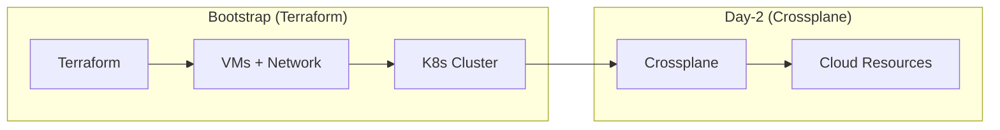
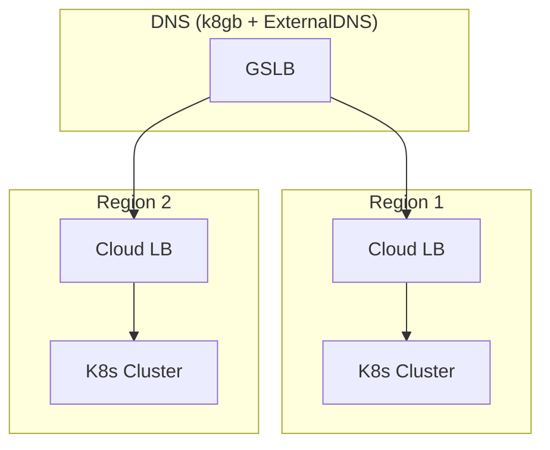

# Terraform

Infrastructure as Code for OpenOva Kubernetes platform (bootstrap only).

**Status:** Accepted | **Updated:** 2026-02-07

---

## Overview

Terraform provisions the initial infrastructure for Kubernetes clusters. After bootstrap, **Crossplane** handles all day-2 cloud resource provisioning.



---

## Supported Providers

OpenOva supports multiple cloud providers. Each provider has a corresponding Crossplane provider for day-2 operations.

| Provider | Crossplane Provider |
|----------|---------------------|
| Hetzner Cloud | provider-hcloud |
| Huawei Cloud | provider-huaweicloud |
| Oracle Cloud (OCI) | provider-oci |
| AWS | provider-aws |
| GCP | provider-gcp |
| Azure | provider-azure |

---

## Directory Structure

```
terraform/
├── modules/
│   ├── <provider>-vm/    # Provider-specific VPS provisioning
│   ├── k3s-cluster/      # K3s installation
│   └── dns-failover/     # CoreDNS + k8gb
├── environments/
│   ├── <provider>-<region>/  # Per-environment configs
│   └── ...
└── README.md
```

---

## Quick Start

```bash
cd environments/<provider>-<region>

# Bootstrap wizard handles credentials interactively
# Creates terraform.tfvars (not committed to Git)

# Initialize and apply
terraform init
terraform plan -var-file=terraform.tfvars
terraform apply -var-file=terraform.tfvars
```

---

## Provider Configuration

### Generic Provider Setup

```hcl
terraform {
  required_providers {
    <provider> = {
      source  = "<provider-source>"
      version = "~> <version>"
    }
  }
}

provider "<provider>" {
  # Credentials via terraform.tfvars or environment variables
}

resource "<provider>_server" "k8s_node" {
  count       = 3
  name        = "<tenant>-k8s-${count.index + 1}"
  # Provider-specific configuration
}

resource "<provider>_network" "k8s_network" {
  name     = "<tenant>-network"
  ip_range = "10.0.0.0/16"
}
```

---

## K3s Cluster Configuration

### Disabled Components

| Component | Reason |
|-----------|--------|
| traefik | Gateway API (Cilium) handles ingress |
| servicelb | Cloud LB or k8gb DNS-based failover |
| local-storage | App-level replication |
| flannel | Cilium CNI |

### Optimization Parameters

| Parameter | Value | Purpose |
|-----------|-------|---------|
| node-monitor-period | 5s | Faster health detection |
| node-monitor-grace-period | 20s | Faster failover |
| default-watch-cache-size | 50 | Memory optimization |
| quota-backend-bytes | 1GB | etcd limit |
| max-pods | 50 | Per-node limit |

---

## Multi-Region Architecture



---

## Secrets Management

**No SOPS:** All secrets handled via interactive bootstrap.

1. **Bootstrap Wizard** prompts for cloud credentials
2. Creates terraform.tfvars locally (not committed to Git)
3. Provisions infrastructure
4. Initializes Vault with generated unseal keys
5. ESO PushSecrets sync to both regional Vaults

See [External Secrets README](../external-secrets/README.md) for full details.

---

## Post-Bootstrap

After Terraform provisioning:

1. Install Cilium CNI
2. Bootstrap Flux (from Gitea)
3. Flux deploys remaining components

All subsequent cloud resources are managed by **Crossplane**, not Terraform.

---

## Consequences

**Positive:**
- Multi-cloud support
- Crossplane support for Day-2
- Native LoadBalancer support (where available)
- Multi-region capable

**Negative:**
- Provider-specific modules required
- Some providers have limited managed services

---

*Part of [OpenOva](https://openova.io)*
