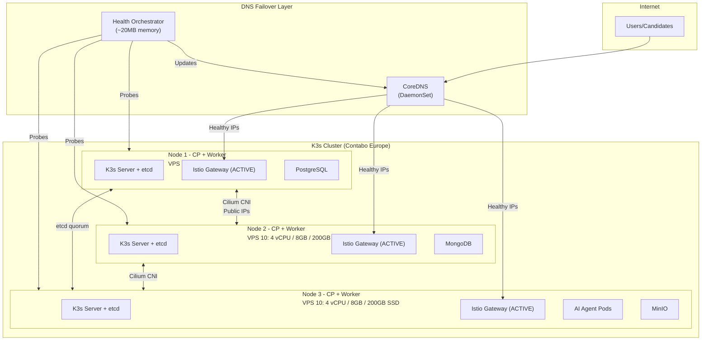
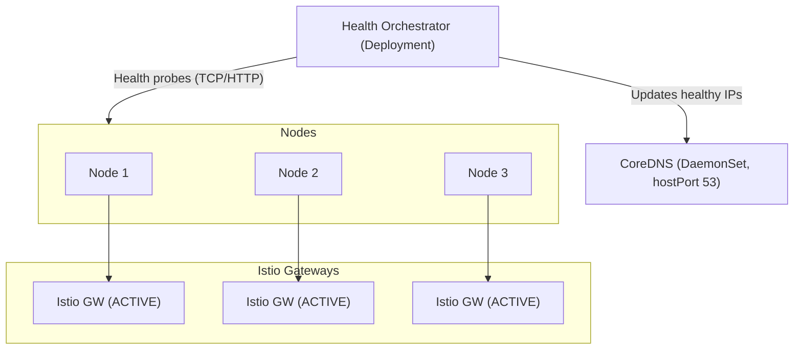

# ADR-014: Contabo VPS Infrastructure

## Status
**Accepted** (Supersedes ADR-011)

## Date
2026-01-06

## Context

Talent Mesh requires compute resources to run AI assessments:
- Speech-to-text (whisper.cpp via whisper-rs)
- Text-to-speech (Piper via piper-rs)
- LLM inference (Claude CLI sessions)
- WebRTC signaling and media processing

Key constraints:
- **Low cost infrastructure**: Minimize monthly spend while maintaining reliability
- **Multi-project foundation**: This infrastructure will serve 10+ future projects
- **Enterprise-grade HA**: etcd quorum with 3 control planes
- **Operational simplicity**: Standard Kubernetes tooling, pure IaC management
- **Middle East latency consideration**: Future optimization for UAE/Oman users

Previous approach (ADR-011):
- Oracle Cloud Always Free with Tailscale mesh VPN
- **Issues encountered**: Severe ARM capacity issues, weeks of waiting, Abu Dhabi region lock-in

## Decision

We will deploy Talent Mesh on a **3-node K3s cluster on Contabo VPS**, with all nodes serving as both Control Plane and Worker.

### Infrastructure Overview



### Contabo VPS 10 Specifications

| Resource | Per Node | Total (3 Nodes) |
|----------|----------|-----------------|
| vCPU | 4 | 12 |
| RAM | 8 GB | 24 GB |
| Storage | 200 GB SSD | 600 GB |
| Bandwidth | 200 Mbit/s | 200 Mbit/s |
| Traffic | 32 TB/month | 32 TB/month |
| Public IP | 1 IPv4 | 3 IPv4 |
| **Cost** | €4.50/month | **€13.50/month (~$15)** |

### K3s Configuration

```bash
# First control plane node (cluster initialization)
curl -sfL https://get.k3s.io | sh -s - server \
  --cluster-init \
  --disable traefik \
  --disable servicelb \
  --disable local-storage \
  --flannel-backend=none \
  --disable-network-policy \
  --kube-controller-manager-arg="node-monitor-period=5s" \
  --kube-controller-manager-arg="node-monitor-grace-period=20s" \
  --kube-apiserver-arg="default-watch-cache-size=50" \
  --etcd-arg="quota-backend-bytes=1073741824" \
  --kubelet-arg="max-pods=50" \
  --kubelet-arg="image-gc-high-threshold=70" \
  --kubelet-arg="image-gc-low-threshold=50"

# Additional control plane nodes (join existing cluster)
curl -sfL https://get.k3s.io | K3S_URL=https://<first-node-ip>:6443 \
  K3S_TOKEN=<token> sh -s - server \
  --disable traefik \
  --disable servicelb \
  --disable local-storage \
  --kube-controller-manager-arg="node-monitor-period=5s" \
  --kube-controller-manager-arg="node-monitor-grace-period=20s" \
  --kube-apiserver-arg="default-watch-cache-size=50" \
  --kubelet-arg="max-pods=50" \
  --kubelet-arg="image-gc-high-threshold=70" \
  --kubelet-arg="image-gc-low-threshold=50"
```

### Disabled K3s Components

| Component | Reason |
|-----------|--------|
| `traefik` | Istio Ingress Gateway handles all ingress |
| `servicelb` | DNS-based failover, not LoadBalancer services |
| `local-storage` | Application-level storage replication |
| `flannel` | Cilium CNI used instead (eBPF-based) |
| `network-policy` | Cilium provides L3-L7 network policies |

**Kept enabled:** `metrics-server` (required for HPA and monitoring)

### Load Balancing: DNS-Based Failover

**Why not kube-vip or MetalLB?**
- **MetalLB**: Doesn't work on VPS providers (virtualized ARP)
- **kube-vip**: Causes idle Istio Ingress Gateways (only leader receives traffic)

**Solution:** Self-hosted CoreDNS + Health Orchestrator
- All Istio Ingress Gateways are **ACTIVE** (no idle resources)
- DNS returns only healthy node IPs
- ~20MB additional memory overhead
- Pure IaC management (Helm chart)



### Service Mesh: Istio Ambient Mode

**Why Ambient Mode?**
- No sidecar containers (saves ~50MB per pod)
- Simplified debugging
- Faster pod startup
- Same mTLS and traffic management capabilities

**Components:**
- `ztunnel`: L4 proxy (DaemonSet)
- `waypoint`: L7 proxy (on-demand for advanced policies)

### Storage Strategy

| Component | Storage | Replication |
|-----------|---------|-------------|
| PostgreSQL | Local SSD | Application-level streaming replication |
| MongoDB | Local SSD | Replica set (application-level) |
| Redis | Local SSD | Single instance (MVP, rebuildable) |
| MinIO | Local SSD | Erasure coding across nodes |

**No CSI drivers needed** - all replication handled at application level.

### Networking

| Aspect | Implementation |
|--------|----------------|
| CNI | Cilium (eBPF-based) |
| Inter-node | Public IPs (no VPN overlay) |
| Service mesh | Istio Ambient Mode (mTLS) |
| External DNS | Self-hosted CoreDNS |
| Load balancing | DNS-based failover |

**No Tailscale required** - nodes communicate via public IPs with Cilium CNI.

## Consequences

### Positive
- **Low cost**: ~€13.50/month (~$15) for production workloads
- **Enterprise-grade HA**: 3-node etcd quorum tolerates 1 node failure
- **Immediate provisioning**: No capacity waiting (unlike Oracle Cloud)
- **Standard tooling**: kubectl, Helm, ArgoCD all work normally
- **Predictable environment**: Consistent specs across all nodes
- **All gateways active**: DNS failover means no idle resources
- **Multi-project ready**: Foundation for 10+ future projects
- **Pure IaC**: 100% Terraform/Helm managed

### Negative
- **Monthly cost**: ~$15/month vs $0 (Oracle Always Free)
- **No ARM64**: x86_64 only (Contabo doesn't offer ARM VPS)
- **Single provider**: Locked to Contabo for this environment
- **Public IPs**: Requires proper firewall configuration
- **Self-managed**: No managed database services

### Mitigations
- **Cost**: Still extremely affordable, excellent value ($0.54/GB RAM)
- **x86_64**: All our containers work on x86_64, no ARM dependency
- **Provider lock-in**: Terraform modules enable migration to other providers
- **Security**: K8s NetworkPolicies + Istio mTLS + OS-level firewall
- **Self-managed**: Application-level replication is well-documented

## Comparison with Superseded ADR-011

| Aspect | ADR-011 (Oracle) | ADR-014 (Contabo) |
|--------|------------------|-------------------|
| Provider | Oracle Cloud Always Free | Contabo VPS |
| Nodes | 2 (1 CP + 1 Worker) | 3 (all CP + Worker) |
| Monthly Cost | $0 | ~€13.50 (~$15) |
| Networking | Tailscale mesh VPN | Public IPs + Cilium |
| Load Balancing | Not specified | DNS-based failover |
| Service Mesh | Istio (sidecars) | Istio Ambient Mode |
| Storage | Block storage + MinIO | Local SSD + MinIO |
| HA | Single control plane | 3-node etcd quorum |
| Provisioning | Weeks (capacity issues) | Immediate |

## Capacity Analysis

For target workload of **500 assessments/month** (MVP):

| Resource | Available | Per Assessment | Capacity |
|----------|-----------|----------------|----------|
| CPU | 12 vCPU | ~0.5 vCPU/session | 24 concurrent |
| RAM | 24 GB | ~3 GB/session | 8 concurrent |
| Storage | 600 GB | ~500 MB/recording | 1,200 recordings |

**Conclusion**: Cluster can handle ~6-8 concurrent assessments, sufficient for MVP.

## Implementation

### Phase 1: Terraform Development
1. Create Contabo VM module
2. Create K3s cluster module (3 CP + Worker)
3. Create DNS failover Helm chart
4. Create Istio Ambient installation module

### Phase 2: Deployment
1. Provision 3 VPS 10 instances in Europe
2. Bootstrap K3s cluster with etcd quorum
3. Deploy CoreDNS + Health Orchestrator
4. Deploy Istio Ambient Mode
5. Deploy MinIO for object storage

### Phase 3: Validation
1. Verify etcd quorum health
2. Test DNS failover (node failure simulation)
3. Validate Istio Ambient Mode mTLS
4. Run load tests

### Phase 4: Future Migration (Optional)
1. When ME latency critical, provision in Contabo India
2. Or migrate to higher-tier VPS (VPS 20, VPS 30)

## References

### Internal Documentation
- [ADR-008: Remove Kong and Traefik, Use Istio Only](./ADR-008-REMOVE-KONG-USE-ISTIO.md)
- [ADR-013: Secrets with SOPS and ESO](./ADR-013-SECRETS-SOPS-ESO.md)
- [Infrastructure Agreements](../08-operations/INFRASTRUCTURE_AGREEMENTS.md)
- [Cloud Provider Cost Comparison](../08-operations/CLOUD_PROVIDER_COST_COMPARISON.md)
- [Vendor Evaluation](../08-operations/VENDOR_EVALUATION.md)

### External Resources
- [Contabo VPS](https://contabo.com/en/vps/)
- [Contabo Terraform Provider](https://registry.terraform.io/providers/contabo/contabo/latest)
- [K3s Documentation](https://docs.k3s.io/)
- [Istio Ambient Mode](https://istio.io/latest/docs/ambient/)
- [SOPS](https://github.com/getsops/sops)
