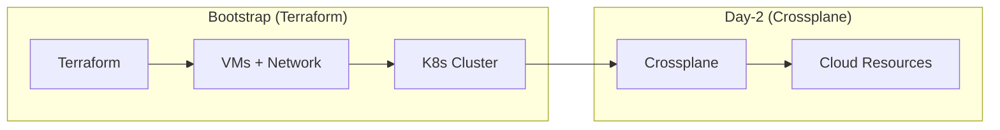
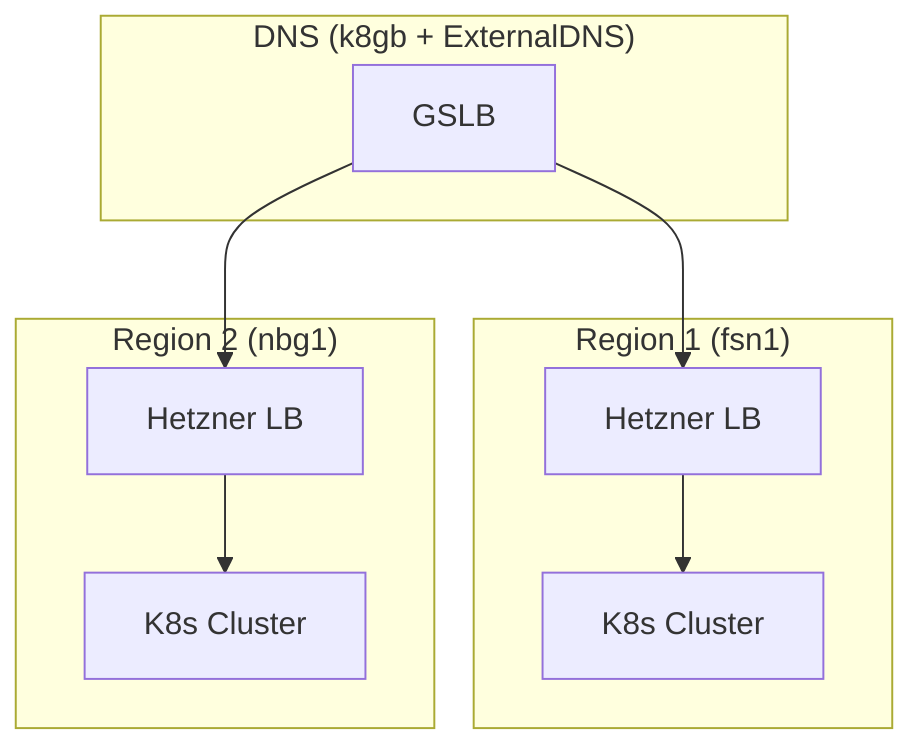

# ADR: Infrastructure Providers

**Status:** Accepted
**Date:** 2024-06-01
**Updated:** 2026-01-16

## Context

Need infrastructure providers for Kubernetes cluster provisioning that support:
- Crossplane provider availability
- Multi-region deployments
- Cost-effective pricing
- API-driven provisioning

## Decision

Use **Hetzner Cloud** as the primary infrastructure provider, with additional providers coming.

## Provider Status

| Provider | Status | Crossplane | Notes |
|----------|--------|------------|-------|
| **Hetzner Cloud** | Available | provider-hcloud | Primary provider |
| Huawei Cloud | Coming | provider-huaweicloud | China/APAC focus |
| Oracle Cloud (OCI) | Coming | provider-oci | Always Free tier |
| AWS | Coming | provider-aws | Full featured |
| GCP | Coming | provider-gcp | Full featured |
| Azure | Coming | provider-azure | Full featured |
| ~~Contabo~~ | **Dropped** | None | No Crossplane support |

## Why Hetzner Cloud?

| Factor | Hetzner | AWS/GCP/Azure | Contabo |
|--------|---------|---------------|---------|
| Cost | Low | High | Low |
| Crossplane | provider-hcloud | Full support | None |
| API Quality | Good | Excellent | Basic |
| Regions | EU, US | Global | EU, US, Asia |
| LoadBalancer | Native | Native | None |

**Key Decision:** Contabo dropped due to lack of Crossplane provider support.

## Hetzner Configuration

### Available Regions

| Region | Location | Use Case |
|--------|----------|----------|
| `fsn1` | Falkenstein, DE | Primary EU |
| `nbg1` | Nuremberg, DE | DR EU |
| `hel1` | Helsinki, FI | EU alternative |
| `ash` | Ashburn, US | Primary US |
| `hil` | Hillsboro, US | DR US |

### Instance Types

| Type | vCPU | RAM | SSD | Monthly |
|------|------|-----|-----|---------|
| CX22 | 2 | 4GB | 40GB | €4.59 |
| CX32 | 4 | 8GB | 80GB | €9.18 |
| CX42 | 8 | 16GB | 160GB | €18.35 |
| CX52 | 16 | 32GB | 320GB | €36.70 |

**Recommended:** CX32 (3 nodes) for minimum production cluster

### Terraform Configuration

```hcl
terraform {
  required_providers {
    hcloud = {
      source  = "hetznercloud/hcloud"
      version = "~> 1.45"
    }
  }
}

provider "hcloud" {
  token = var.hcloud_token
}

resource "hcloud_server" "k8s_node" {
  count       = 3
  name        = "<tenant>-k8s-${count.index + 1}"
  server_type = "cx32"
  image       = "ubuntu-22.04"
  location    = "fsn1"

  ssh_keys = [hcloud_ssh_key.default.id]

  labels = {
    tenant = "<tenant>"
    role   = "k8s-node"
  }
}

resource "hcloud_network" "k8s_network" {
  name     = "<tenant>-network"
  ip_range = "10.0.0.0/16"
}

resource "hcloud_network_subnet" "k8s_subnet" {
  network_id   = hcloud_network.k8s_network.id
  type         = "cloud"
  network_zone = "eu-central"
  ip_range     = "10.0.1.0/24"
}
```

## Bootstrap vs Day-2



- **Terraform**: Bootstrap only (VMs, network, initial K8s)
- **Crossplane**: Day-2 operations (additional cloud resources)

## Multi-Region Architecture



## Consequences

**Positive:**
- Cost-effective infrastructure
- Crossplane support for Day-2
- Native LoadBalancer support
- Good API for automation

**Negative:**
- Fewer regions than hyperscalers
- Less mature than AWS/GCP/Azure
- Limited managed services

## Migration from Contabo

If migrating from Contabo:

1. Provision Hetzner infrastructure via Terraform
2. Deploy K8s cluster
3. Migrate workloads (Velero backup/restore)
4. Update DNS to point to Hetzner
5. Decommission Contabo

## Related

- [ADR-CROSSPLANE](../../crossplane/docs/ADR-CROSSPLANE.md)
- [SPEC-INFRASTRUCTURE-SETUP](./SPEC-INFRASTRUCTURE-SETUP.md)
